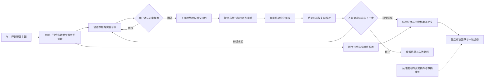
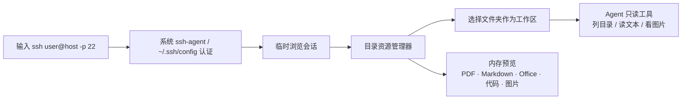
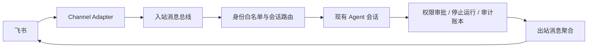

# oph-autoresearch

面向眼科影像 / AI 研究的主控对话工作台。项目、服务器目录和数据准备好后，告诉主控一个大致主题，它使用预设专职代理调研论文与投稿刊会，整理候选课题和实验草案；你确认方案后，主控继续安排实验准备、执行、结果复核、论文写作和团队审稿。

> 当前处于 MVP 开发阶段，仅用于科研辅助，不是医疗器械，不提供临床诊断或治疗建议。

## MVP 能做什么

- 直接从聊天主题启动“文献与刊会调研 → 方案卡确认 → 子代理实验准备 → 已授权实验 → 结果复核与迭代 → 写作与审稿”。前期调研不要求配置正式实验执行器。
- 刊会专员并行维护每个刊会的版本档案：官方要求、目标届次、代表论文、引用统计来源与日期、范文写法推断；同项目可检索复用。
- 在聊天中查看并确认具体方案版本；版本或目录变化后重新确认，重复确认不会重复派发同一次交接。
- 审稿案例记录稿件版本、审稿轮次、来源与用途；模型资料入口只提供获准用于上下文的训练集案例。当前不连接参数微调，也未训练审稿模型。
- 原始影像、DICOM 头和患者标识留在 SSH 服务器，本机只保存脱敏汇总与研究产物。
- 自动初始化流程编排、问题设计、SSH 数据审计、方案统计、远程实验、独立复核和证据写作 Skill。
- 默认提供文献与证据缺口、刊会分析、数据审计、方案统计、实验准备与执行、结果分析与迭代、证据写作，以及临床、方法学、可复现、稿件等独立审阅角色；角色绑定职责与必读 Skill。
- 模型与角色解耦：角色默认继承当前会话模型，也可在 `.oph/team.json` 中分别配置 provider / model / effort。
- 探测并调用 Claude Code、Codex CLI、Gemini、Qwen、Grok、Kimi 等本机原生 CLI。
- 在中央 Remote SSH 工作台输入系统 `ssh` 命令，连接后选择远程文件夹，并设置为只读浏览或实验读写 Agent 工作区。
- 左侧组织项目与研究对话，右侧独立提供“文件 / 流程”；Markdown、代码、PDF、图片及现代 Office 文档均在中央打开。
- 以统一控制面配置飞书机器人；凭证只引用环境变量，操作者必须在白名单内。
- 使用 workflow DAG、checkpoint、revise / resume 和 SQLite 账本保留可追溯过程。
- 首次未配置模型时显示配置引导，可直接进入模型设置；配置完成后引导自动消失。

后续计划接入医生标注与结果审阅网站，形成主动学习和标注复核闭环。

## 研究流程



主控负责派发专职代理并核验交接，研究文件由对应专员产出。结果分析给出接受、迭代或停止建议；继续实验时生成带变更说明的新方案，并重新确认方案版本。写作分别使用证据边界、刊会格式和范文写法 Skill。没有真实结果时不能把提纲或占位文字保存成完整结果稿。旧六阶段详情保留在“高级详情”，不要求用户在日常聊天中操作底层状态机。

人工检查点在对话中提供“批准”和“返工”，并展示核验清单、结果分析建议与下一步增量。返工需填写意见，沿原工作流与子会话继续；过期卡片、重复批准和模型代替人类批准都会被拒绝。方案确认与正式实验授权分别处理，确认方案不会直接启动训练。

独立审阅角色优先选择已配置凭证的其他模型接口，并按有效模型目录中的推理能力、上下文容量排序；角色的显式模型配置优先。没有合适的独立接口时，检查点会标注“同模型审查”，不把这种结果当作已经满足独立性。

修正依据与验收记录见 [主控对话科研流程修正](docs/research/chat-first-correction-2026-09-06.md)。这次改造包含流程与资料能力，不代表已完成真实课题实验、投稿或模型参数训练。

## 软件内工作流


应用启动后中央区域默认保持主 Agent 对话。左侧只组织项目和研究对话，右侧以“文件 / 流程”两个页签分别承担文件导航与研究执行链。点击文件后中央区域切成编辑器或预览器，选择左侧对话则恢复聊天；点击任一流程阶段后，Agent、模型、当前任务、阶段结果、约定产物和检查点在中央详情中查看。SSH 入口固定在顶栏导出按钮左侧，远程浏览同样占用中央区域。

本地文件预览不会上传第三方服务：Markdown 在应用内渲染并可切换源码，代码按语言加载语法高亮，PDF 使用系统 WebView 阅读器；`.docx`、`.pptx`、`.xlsx` 在本机解包为无脚本的只读 HTML。旧版 `.doc`、`.ppt`、`.xls` 需要先另存为现代 OOXML 格式。

## Remote SSH 工作区



连接命令只做参数解析，不交给 shell；高级代理、跳板机和密钥选择写入系统 SSH config。远程文件只读入受限内存用于预览，不落地临时副本，也不提供上传、下载、保存或修改入口。Office 预览支持 OOXML（`.docx` / `.xlsx` / `.pptx`）文本化查看；旧版二进制 Office、DICOM 和 NIfTI 由 Agent 在远端进行只读分析。

研究预设增加 `experiment`（smoke → 人类批准 → 分离启动）和 `results`（收集 → 独立复核 → 结果分析与复现检查 → 人类裁决）。长任务用 `ssh_run_command` 的 `detach: true` 返回 `runDir/pid`，用 `ssh_job_status` 查询 `running/completed/failed/unknown`，监控复用 `create_schedule`。远端需 Linux 的 `bash`、`setsid`、`nohup` 与 GNU `realpath`；状态与日志仅保存在远端 `oph-jobs` 目录。

## 远程遥控通道



飞书通知队列、官方 WebSocket 群聊、操作者白名单及分级裁决已完成本地实现，真实平台联调尚未完成。设置中填写应用、密钥环境变量、群与主会话后重启服务。群内须 @机器人；批准或返工须引用检查点卡片。群 Web 深链需先配对，且仅同一局域网或已配置的安全网络可达。通道不得创建旁路 Agent，也不能绕过桌面的权限与审批链。

飞书自建应用需开启机器人、长连接事件订阅 `im.message.receive_v1` 与卡片回调 `card.action.trigger`，并授权消息发送、读取引用消息及群内 @ 消息权限。通道的“仅发起对话 / 对话 + 审批 / 对话 + 审批 + 停止运行”分别限定机器人入口；Web 使用独立的本机配对权限。应用密钥只通过配置的环境变量提供。通道仅在服务运行时在线。

## 架构调研与开源参考

OpenJiuwen 的 `agent-core`、`agent-runtime`、`agent-protocol`、`deepsearch`、`skillhub` 与 `jiuwenswarm` 分别对应本项目的 Agent/Workflow 内核、运行时分层、MCP/A2A 协议、深度研究编排、Skill 分发和机器人通道边界。特别借鉴 `jiuwenswarm` 的 `BaseChannel → ChannelManager → inbound/outbound pipeline → session router`，但不把外部通道直接耦合到 Agent Loop。

截至 2026-09-03，优先参考的高活跃开源项目包括：Scientific Agent Skills、STORM、GPT Researcher、MLflow、DVC、RD-Agent、PaperQA2、nnU-Net、MONAI、Agent Laboratory、Biomni、Deepchecks、Fairlearn 与 AIDE。六阶段对应关系、许可证提醒和具体借鉴点见 [开源架构参考](docs/research/open-source-stack.md)。

多智能体运行采用“Campaign 状态真源 + 可复用 Pattern + 独立角色 + 证据/审批账本”的分层方案。Google Teamwork、近期工作流恢复能力和本项目九阶段执行模型的具体取舍见 [docs/orchestration.md](docs/orchestration.md)。

## 安全边界

```text
本机：研究问题、方案、Agent 调度、脱敏汇总、运行回执、审计账本
  │ SSH（只读审计；批准后才允许实验写入）
  ▼
服务器：原始眼科影像、患者级索引、训练代码、GPU 作业、模型产物
```

- 数据审计默认只读，禁止下载原始影像或输出患者级信息。
- 方案冻结后必须经过人工检查点，才可启动训练。
- 实验执行者与结果审查者应使用不同模型，或至少使用互不共享上下文的独立会话。
- 产物中的每项结论必须能追溯到数据快照、配置、代码版本和运行回执。

## 本地开发

需要 [Bun 1.3.14+](https://bun.sh)、Node.js 22+；桌面模式还需要 Rust / Cargo 和系统 WebView2。

```powershell
git clone https://github.com/OpenMedAILab/oph-autoresearch.git
cd oph-autoresearch
bun install
./scripts/start.ps1 -Mode web
```

macOS / Linux 或不使用 PowerShell 时，可启动构建后的 Web 服务：

```sh
bun run build:web
bun run packages/cli/src/index.ts serve --host 127.0.0.1 --port 7717 --static apps/web/dist
```

打开终端输出的本机访问链接。首次未配置模型时，点击“配置模型”，选择模型接口并填写 API Key；更改会即时保存，完成后提示自动消失。本地免密接口不要求 Key。也可运行 `bun run packages/cli/src/index.ts init` 在终端配置。

配置和会话数据库默认保存在 `~/.oph-autoresearch/`。使用 `OPH_AUTORESEARCH_HOME` 指定其他数据目录后，每次启动都应使用同一个值；切换目录会显示另一套项目与配置。当前配置文件位置可在“系统设置 → 通用”查看。

桌面开发使用 `bun run dev`，或在 PowerShell 中运行：

```powershell
./scripts/start.ps1
```

首次打开研究项目时，应用补齐缺失的 `.agents/skills/*`、`.oph/team.json` 和 `research/*`。旧团队配置会补充缺失角色；仍等于早期模板默认值的提示词、技能、工具面与 Skill 文件随模板升级，用户改过的一律不动。

SSH 从顶栏终端图标进入中央 Remote SSH 工作台。每次成功连接都会保存主机、用户名、端口、认证方式和最近连接时间，便于快速重连，但不会保存密码、私钥或口令。连接后可直接输入远程路径，或在资源管理器中逐级进入数据目录，再选择“设为 Agent 工作区”；确认过的目录会保存在“已保存数据目录”中。工作区默认只读；选择“实验读写”并点击“设为 Agent 工作区”后，Agent 可使用 `ssh_run_command` 进行预处理、训练及文件修改，也可随时重新设为只读。命令以该目录为起始位置，实际访问范围由 SSH 账号权限决定，所选目录不是远程 shell 沙箱。不要把凭证或患者路径写进仓库。

## 使用本机与服务器 CLI 模型

主对话既可使用 API，也可使用已安装的原生 CLI。应用启动后自动在后台探测本机及已保存的 SSH 服务器，读取登录状态与模型目录，本机模型加载到主控模型列表，远程 CLI 能力只在“SSH 服务器”中展示。在“系统设置 → 模型”查看进度或手动重新探测；新建 SSH 连接和修改工作区后会自动更新。远程探测复用服务器自己的 CLI 登录以及应用已有的 SSH 认证，不复制本机模型凭证。本机主控模型负责规划、协调与审核，远程 CLI 是实验执行端，不可选作主控模型。只读连接可以探测，实验执行仍遵循 SSH 工具权限和审批。Codex 使用 app-server 的 account/read 与 model/list；Claude 使用 auth status 和控制协议初始化目录；Grok 使用 models 命令（未明确返回登录状态时会标记未确认）。未登录或探测失败不会加载模型，不根据凭证文件存在推断登录。探针不发送推理请求，结果缓存五分钟，可手动刷新；目录可见不保证账户额度。

CLI 模式使用自身登录、工具和权限机制；应用的 API Agent 工具、流程审批和计费统计不注入原生 CLI。当前支持文本及项目文件路径输入，回答完成后显示，历史与回答保存到研究对话中；停止按钮会中断 CLI 进程。CLI 费用与用量请查看对应账户。

## 测试

```powershell
bun run gate
bun run build
```

`gate` 包含 TypeScript / Solid 类型检查、Biome、单元与集成测试、Rust `cargo check`。开发分支只有在这些检查通过，并完成本地界面冒烟测试后才推送。

真实模型抽样可运行 `bun run scripts/smoke-research-discovery.ts --help` 查看用法；默认不发起请求，显式 `--run` 才执行一轮 discovery 并生成待人工评分的记录。

本地回归覆盖人工批准与返工、重复裁决、分离 SSH 作业状态、结构化回执、引用与方案来源、会话用量和首次配置引导。脚本化模型用例还检查虚构引用、修改冻结方案、把摘要当作全文依据，以及把退出码 0 当作科学结果成功等情况。

飞书真实消息与卡片握手、真实模型 discovery 评分和真实 GPU 长任务仍待联调。远端 CLI 的实验执行联调需准备对应环境；跨研究失败路线检索与 Skill 修订提案待积累真实实验样本后实现。

## 关键研究产物

| 阶段 | 产物 |
| --- | --- |
| 研究问题 | `research/research_question.yaml` |
| 远程数据审计 | `research/dataset_manifest.json` |
| 方案冻结 | `research/study_protocol.md`、`research/experiment_spec.yaml` |
| 训练与评估 | `research/run_receipt.json` |
| 独立复核 | `research/claim_evidence_map.yaml` |
| 研究输出 | 研究报告、模型卡、图表说明与复现清单 |

版本化产物统一保存在应用的文档账本中；失败路线、反例与偏倚风险写入 `research/pitfall_registry.yaml`，不会因为下一轮综合而丢失。

科研节点可声明输出契约，在节点完成时校验结构化回执；缺少必填字段、多个末尾 JSON 或迭代建议缺少下一步增量时，该节点失败，下游节点跳过。失败回执需返工后再批准，引用和科学主张仍由文档来源核验。

分离实验的登记同时匹配 SSH 启动与终态回执中的运行目录、PID 和接口；指标须与实际日志汇总一致，`unknown` 不作为终态结果。真实失败运行可以留作工程证据，进程退出码不代替独立结果复核。

科研面板汇总当前主会话及全部子会话的累计 API 用量，包括嵌套与已归档会话。金额按币种分列；外部 CLI 等未报告的用量单独标明，不计入合计。同一主会话里的多个课题共享这个统计范围，结果分析可结合方案预算与停止规则提出建议。

## 技术栈

- Bun + TypeScript Agent Loop
- SolidJS Web UI
- Tauri 2 桌面壳
- SQLite 本地运行账本
- Skills、MCP、Plugins、多 Agent 与外部 CLI

## 许可证与来源

OpenMedAILab 新增代码按根目录 [MIT License](LICENSE) 授权。项目包含 Apache-2.0 授权的第三方框架代码；其法定归属与许可文本见 [Apache-2.0](LICENSES/Apache-2.0.txt)、[NOTICE](NOTICE) 和 [第三方许可证清单](THIRD_PARTY_NOTICES.md)。
