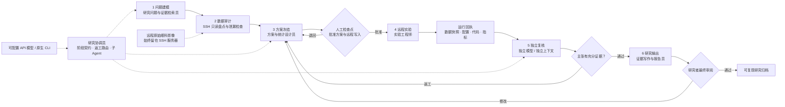
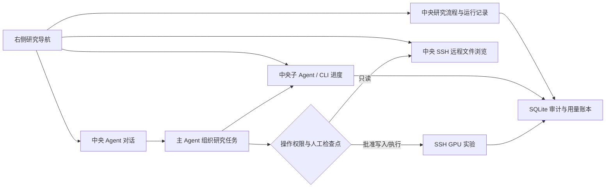
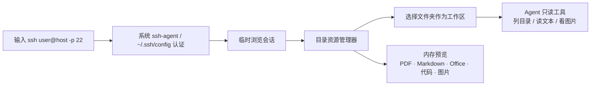
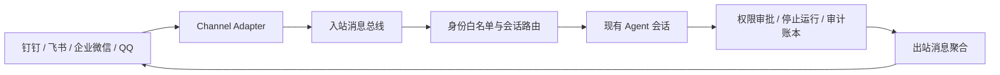

# oph-autoresearch

面向眼科影像 / AI 模型研究的本地优先自动科研工作台。它保留成熟的 Agent、Workflow、Skill、CLI、Tauri 与 SQLite 分层架构，在本机组织研究、调度多模型 Agent、保存审计记录，并通过 SSH 在远程服务器上盘点数据与执行 GPU 实验。

> 当前处于 MVP 开发阶段，仅用于科研辅助，不是医疗器械，不提供临床诊断或治疗建议。

## MVP 能做什么

- 从“问题建模 → 数据审计 → 方案冻结 → 远程实验 → 独立复核 → 研究输出”组织研究执行链。
- 原始影像、DICOM 头和患者标识留在 SSH 服务器，本机只保存脱敏汇总与研究产物。
- 自动初始化流程编排、问题设计、SSH 数据审计、方案统计、远程实验、独立复核和证据写作 Skill。
- 默认提供一个协调角色和六个阶段角色；角色已经绑定职责模块与必读 Skill。
- 模型与角色解耦：角色默认继承当前会话模型，也可在 `.oph/team.json` 中分别配置 provider / model / effort。
- 探测并调用 Claude Code、Codex CLI、Gemini、Qwen、Grok、Kimi 等本机原生 CLI。
- 在中央 Remote SSH 工作台输入系统 `ssh` 命令，连接后选择远程文件夹作为只读 Agent 工作区。
- 以统一控制面配置钉钉、飞书、企业微信官方 AI Bot 与 QQ 机器人；凭证只引用环境变量，操作者必须在白名单内。
- 使用 workflow DAG、checkpoint、revise / resume 和 SQLite 账本保留可追溯过程。

后续计划接入医生标注与结果审阅网站，形成主动学习和标注复核闭环。

## 研究流程



流程中的每个 Agent 角色都可以独立配置模型、推理强度和 CLI 后端。方案冻结、实验写入与结论发布均设置人工检查点，自动化负责执行与留痕，研究者保留最终决定权。

## 软件内工作流



应用启动后中央区域默认保持主 Agent 对话。右侧的“研究流程”“子 Agent”“SSH 数据”是状态入口：点击后详情在中央打开，不把复杂进度压缩在窄侧栏里；详情页可随时返回对话。

## Remote SSH 只读工作区



连接命令只做参数解析，不交给 shell；高级代理、跳板机和密钥选择写入系统 SSH config。远程文件只读入受限内存用于预览，不落地临时副本，也不提供上传、下载、保存或修改入口。Office 预览支持 OOXML（`.docx` / `.xlsx` / `.pptx`）文本化查看；旧版二进制 Office、DICOM 和 NIfTI 由 Agent 在远端进行只读分析。

## 远程遥控通道



MVP 已落地统一通道配置、凭证状态、操作者白名单和遥控级别控制面。平台长连接适配器按“钉钉 Stream、飞书 WebSocket、企业微信官方 AI Bot、QQ 官方机器人”顺序接入；不会使用非官方个人微信协议。通道不得创建旁路 Agent，也不能绕过桌面的权限与审批链。

## 架构调研与开源参考

OpenJiuwen 的 `agent-core`、`agent-runtime`、`agent-protocol`、`deepsearch`、`skillhub` 与 `jiuwenswarm` 分别对应本项目的 Agent/Workflow 内核、运行时分层、MCP/A2A 协议、深度研究编排、Skill 分发和机器人通道边界。特别借鉴 `jiuwenswarm` 的 `BaseChannel → ChannelManager → inbound/outbound pipeline → session router`，但不把外部通道直接耦合到 Agent Loop。

截至 2026-09-03，优先参考的高活跃开源项目包括：Scientific Agent Skills、STORM、GPT Researcher、MLflow、DVC、RD-Agent、PaperQA2、nnU-Net、MONAI、Agent Laboratory、Biomni、Deepchecks、Fairlearn 与 AIDE。六阶段对应关系、许可证提醒和具体借鉴点见 [research/OPEN_SOURCE_STACK.md](research/OPEN_SOURCE_STACK.md)。

## 安全边界

```text
本机：研究问题、方案、Agent 调度、脱敏汇总、运行回执、审计账本
  │ SSH（只读审计；批准后才允许实验写入）
  ▼
服务器：原始眼科影像、患者级索引、训练代码、GPU 作业、模型产物
```

- 数据审计默认只读，禁止下载原始影像或输出患者级信息。
- 方案冻结后必须经过人工检查点，才可启动训练。
- 实验执行者与结果审查者应使用不同模型，或至少使用互不共享上下文的独立会话。
- 产物中的每项结论必须能追溯到数据快照、配置、代码版本和运行回执。

## 本地开发

需要 [Bun 1.3.14+](https://bun.sh)、Node.js 22+；桌面模式还需要 Rust / Cargo 和系统 WebView2。

```powershell
git clone https://github.com/OpenMedAILab/oph-autoresearch.git
cd oph-autoresearch
bun install
bun run packages/cli/src/index.ts init
./scripts/start.ps1 -Mode web
```

桌面开发使用：

```powershell
./scripts/start.ps1
```

首次打开研究项目时，应用补齐缺失的 `.agents/skills/*`、`.oph/team.json` 和 `research/*`。旧团队配置会无损补充缺失角色及其 `modules` / `skills`，不会覆盖用户已改的名称、提示词、模型和工具权限。

SSH 从中央“SSH 数据”入口连接。认证使用系统 `~/.ssh/config` 和 `ssh-agent`；只有选择“打开此文件夹作为工作区”后，应用才保存主机、用户名、端口、远程根目录和主机密钥策略，并强制只读。不要把密码、私钥或患者路径写进仓库。

## 测试

```powershell
bun run gate
bun run build
```

`gate` 包含 TypeScript / Solid 类型检查、Biome、单元与集成测试、Rust `cargo check`。开发分支只有在这些检查通过，并完成本地界面冒烟测试后才推送。

## 关键研究产物

| 阶段 | 产物 |
| --- | --- |
| 研究问题 | `research/research_question.yaml` |
| 远程数据审计 | `research/dataset_manifest.json` |
| 方案冻结 | `research/study_protocol.md`、`research/experiment_spec.yaml` |
| 训练与评估 | `research/run_receipt.json` |
| 独立复核 | `research/claim_evidence_map.yaml` |
| 研究输出 | 研究报告、模型卡、图表说明与复现清单 |

## 技术栈

- Bun + TypeScript Agent Loop
- SolidJS Web UI
- Tauri 2 桌面壳
- SQLite 本地运行账本
- Skills、MCP、Plugins、多 Agent 与外部 CLI

## 许可证与来源

OpenMedAILab 新增代码按根目录 [MIT License](LICENSE) 授权。项目包含 Apache-2.0 授权的第三方框架代码；其法定归属与许可文本见 [Apache-2.0](LICENSES/Apache-2.0.txt)、[NOTICE](NOTICE) 和 [第三方许可证清单](THIRD_PARTY_NOTICES.md)。
