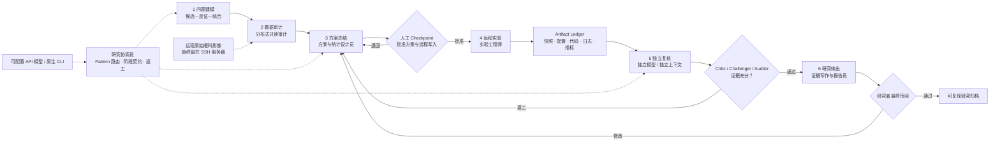
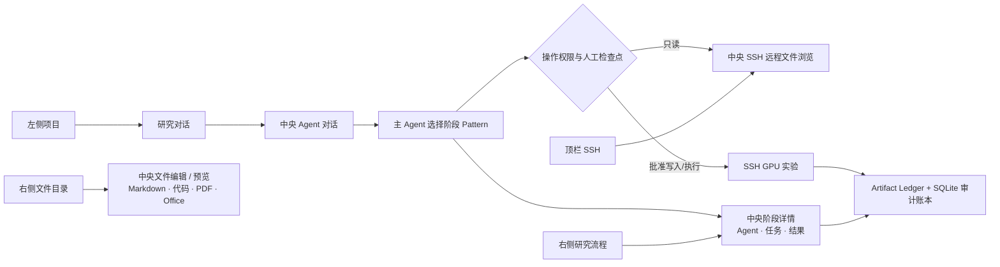
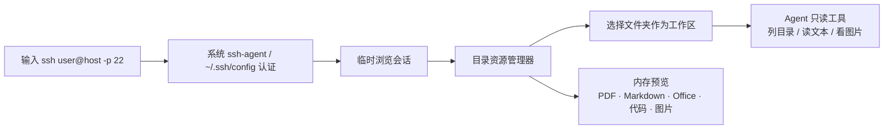
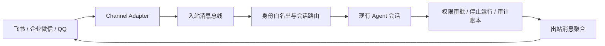

# oph-autoresearch

面向眼科影像 / AI 模型研究的本地优先自动科研工作台。它保留成熟的 Agent、Workflow、Skill、CLI、Tauri 与 SQLite 分层架构，在本机组织研究、调度多模型 Agent、保存审计记录，并通过 SSH 在远程服务器上盘点数据与执行 GPU 实验。

> 当前处于 MVP 开发阶段，仅用于科研辅助，不是医疗器械，不提供临床诊断或治疗建议。

## MVP 能做什么

- 从“问题建模 → 数据审计 → 方案冻结 → 远程实验 → 独立复核 → 研究输出”组织研究执行链。
- 原始影像、DICOM 头和患者标识留在 SSH 服务器，本机只保存脱敏汇总与研究产物。
- 自动初始化流程编排、问题设计、SSH 数据审计、方案统计、远程实验、独立复核和证据写作 Skill。
- 默认提供六个阶段负责人和临床反证、方法学批评、可复现审计等跨阶段角色；角色已经绑定职责模块与必读 Skill。
- 模型与角色解耦：角色默认继承当前会话模型，也可在 `.oph/team.json` 中分别配置 provider / model / effort。
- 探测并调用 Claude Code、Codex CLI、Gemini、Qwen、Grok、Kimi 等本机原生 CLI。
- 在中央 Remote SSH 工作台输入系统 `ssh` 命令，连接后选择远程文件夹，并设置为只读浏览或实验读写 Agent 工作区。
- 左侧组织项目与研究对话，右侧独立提供“文件 / 流程”；Markdown、代码、PDF、图片及现代 Office 文档均在中央打开。
- 以统一控制面配置飞书、企业微信官方 AI Bot 与 QQ 机器人；凭证只引用环境变量，操作者必须在白名单内。
- 使用 workflow DAG、checkpoint、revise / resume 和 SQLite 账本保留可追溯过程。

后续计划接入医生标注与结果审阅网站，形成主动学习和标注复核闭环。

## 研究流程



六阶段是面向医生和审计的固定治理骨架；每个阶段内部从 `.oph/patterns.json` 选择动态协作 Pattern，按任务生成 Explorer、Worker、Critic、Challenger 与 Auditor。每个节点可以独立配置 provider / model 或原生 CLI。方案冻结、实验写入与结论发布均设置人工检查点，自动化负责执行与留痕，研究者保留最终决定权。

## 软件内工作流



应用启动后中央区域默认保持主 Agent 对话。左侧只组织项目和研究对话，右侧以“文件 / 流程”两个页签分别承担文件导航与研究执行链。点击文件后中央区域切成编辑器或预览器，选择左侧对话则恢复聊天；点击任一流程阶段后，Agent、模型、当前任务、阶段结果、约定产物和检查点在中央详情中查看。SSH 入口固定在顶栏导出按钮左侧，远程浏览同样占用中央区域。

本地文件预览不会上传第三方服务：Markdown 在应用内渲染并可切换源码，代码按语言加载语法高亮，PDF 使用系统 WebView 阅读器；`.docx`、`.pptx`、`.xlsx` 在本机解包为无脚本的只读 HTML。旧版 `.doc`、`.ppt`、`.xls` 需要先另存为现代 OOXML 格式。

## Remote SSH 工作区



连接命令只做参数解析，不交给 shell；高级代理、跳板机和密钥选择写入系统 SSH config。远程文件只读入受限内存用于预览，不落地临时副本，也不提供上传、下载、保存或修改入口。Office 预览支持 OOXML（`.docx` / `.xlsx` / `.pptx`）文本化查看；旧版二进制 Office、DICOM 和 NIfTI 由 Agent 在远端进行只读分析。

## 远程遥控通道



MVP 已落地统一通道配置、凭证状态、操作者白名单和遥控级别控制面。平台长连接适配器覆盖飞书 WebSocket、企业微信官方 AI Bot 与 QQ 官方机器人；不会使用非官方个人微信协议。通道不得创建旁路 Agent，也不能绕过桌面的权限与审批链。

## 架构调研与开源参考

OpenJiuwen 的 `agent-core`、`agent-runtime`、`agent-protocol`、`deepsearch`、`skillhub` 与 `jiuwenswarm` 分别对应本项目的 Agent/Workflow 内核、运行时分层、MCP/A2A 协议、深度研究编排、Skill 分发和机器人通道边界。特别借鉴 `jiuwenswarm` 的 `BaseChannel → ChannelManager → inbound/outbound pipeline → session router`，但不把外部通道直接耦合到 Agent Loop。

截至 2026-09-03，优先参考的高活跃开源项目包括：Scientific Agent Skills、STORM、GPT Researcher、MLflow、DVC、RD-Agent、PaperQA2、nnU-Net、MONAI、Agent Laboratory、Biomni、Deepchecks、Fairlearn 与 AIDE。六阶段对应关系、许可证提醒和具体借鉴点见 [research/OPEN_SOURCE_STACK.md](research/OPEN_SOURCE_STACK.md)。

多智能体运行采用“Campaign 状态真源 + 可复用 Pattern + 独立角色 + 证据/审批账本”的分层方案。Google Teamwork、近期工作流恢复能力和本项目九阶段执行模型的具体取舍见 [docs/orchestration.md](docs/orchestration.md)。

## 安全边界

```text
本机：研究问题、方案、Agent 调度、脱敏汇总、运行回执、审计账本
  │ SSH（只读审计；批准后才允许实验写入）
  ▼
服务器：原始眼科影像、患者级索引、训练代码、GPU 作业、模型产物
```

- 数据审计默认只读，禁止下载原始影像或输出患者级信息。
- 方案冻结后必须经过人工检查点，才可启动训练。
- 实验执行者与结果审查者应使用不同模型，或至少使用互不共享上下文的独立会话。
- 产物中的每项结论必须能追溯到数据快照、配置、代码版本和运行回执。

## 本地开发

需要 [Bun 1.3.14+](https://bun.sh)、Node.js 22+；桌面模式还需要 Rust / Cargo 和系统 WebView2。

```powershell
git clone https://github.com/OpenMedAILab/oph-autoresearch.git
cd oph-autoresearch
bun install
bun run packages/cli/src/index.ts init
./scripts/start.ps1 -Mode web
```

桌面开发使用：

```powershell
./scripts/start.ps1
```

首次打开研究项目时，应用补齐缺失的 `.agents/skills/*`、`.oph/team.json`、`.oph/patterns.json` 和 `research/*`。旧团队配置会无损补充缺失角色及其 `modules` / `skills`，不会覆盖用户已改的名称、提示词、模型和工具权限。

SSH 从顶栏终端图标进入中央 Remote SSH 工作台。每次成功连接都会保存主机、用户名、端口、认证方式和最近连接时间，便于快速重连，但不会保存密码、私钥或口令。连接后可直接输入远程路径，或在资源管理器中逐级进入数据目录，再选择“设为 Agent 工作区”；确认过的目录会保存在“已保存数据目录”中。工作区默认只读；选择“实验读写”并点击“设为 Agent 工作区”后，Agent 可使用 `ssh_run_command` 进行预处理、训练及文件修改，也可随时重新设为只读。命令以该目录为起始位置，实际访问范围由 SSH 账号权限决定，所选目录不是远程 shell 沙箱。不要把凭证或患者路径写进仓库。

## 使用本机与服务器 CLI 模型

主对话既可使用 API，也可使用已安装的原生 CLI。应用启动后自动在后台探测本机及已保存的 SSH 服务器，读取登录状态与模型目录，本机模型加载到主控模型列表，远程 CLI 能力只在“SSH 服务器”中展示。在“系统设置 → 模型”查看进度或手动重新探测；新建 SSH 连接和修改工作区后会自动更新。远程探测复用服务器自己的 CLI 登录以及应用已有的 SSH 认证，不复制本机模型凭证。本机主控模型负责规划、协调与审核，远程 CLI 是实验执行端，不可选作主控模型。只读连接可以探测，实验执行仍遵循 SSH 工具权限和审批。Codex 使用 app-server 的 account/read 与 model/list；Claude 使用 auth status 和控制协议初始化目录；Grok 使用 models 命令（未明确返回登录状态时会标记未确认）。未登录或探测失败不会加载模型，不根据凭证文件存在推断登录。探针不发送推理请求，结果缓存五分钟，可手动刷新；目录可见不保证账户额度。

CLI 模式使用自身登录、工具和权限机制；应用的 API Agent 工具、流程审批和计费统计不注入原生 CLI。当前支持文本及项目文件路径输入，回答完成后显示，历史与回答保存到研究对话中；停止按钮会中断 CLI 进程。CLI 费用与用量请查看对应账户。

## 测试

```powershell
bun run gate
bun run build
```

`gate` 包含 TypeScript / Solid 类型检查、Biome、单元与集成测试、Rust `cargo check`。开发分支只有在这些检查通过，并完成本地界面冒烟测试后才推送。

## 关键研究产物

| 阶段 | 产物 |
| --- | --- |
| 研究问题 | `research/research_question.yaml` |
| 远程数据审计 | `research/dataset_manifest.json` |
| 方案冻结 | `research/study_protocol.md`、`research/experiment_spec.yaml` |
| 训练与评估 | `research/run_receipt.json` |
| 独立复核 | `research/claim_evidence_map.yaml` |
| 研究输出 | 研究报告、模型卡、图表说明与复现清单 |

所有阶段同时更新 `research/artifact_ledger.yaml`；失败路线、反例与偏倚风险写入 `research/pitfall_registry.yaml`，不会因为下一轮综合而丢失。

## 技术栈

- Bun + TypeScript Agent Loop
- SolidJS Web UI
- Tauri 2 桌面壳
- SQLite 本地运行账本
- Skills、MCP、Plugins、多 Agent 与外部 CLI

## 许可证与来源

OpenMedAILab 新增代码按根目录 [MIT License](LICENSE) 授权。项目包含 Apache-2.0 授权的第三方框架代码；其法定归属与许可文本见 [Apache-2.0](LICENSES/Apache-2.0.txt)、[NOTICE](NOTICE) 和 [第三方许可证清单](THIRD_PARTY_NOTICES.md)。
